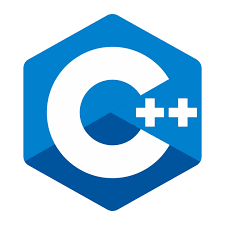
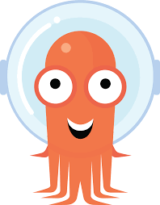

### Hi there, i'm [QI](https://guoqiangqi.github.io/)(he/his) 👋

- 🌱 I'm familiar with [Deep Learning](https://en.wikipedia.org/wiki/Deep_learning)(Object Detection) / [AutoML](https://en.wikipedia.org/wiki/Automated_machine_learning)(NAS, Darts) and [Numerical Optimization]().  

- 🔭 I worked on [Eigen](https://gitlab.com/libeigen/eigen)(member of Eigen), which is a C++ template library for linear algebra: matrices, vectors, numerical solvers, and related algorithms, also is used in [Tensorflow](https://github.com/tensorflow/tensorflow).  

- ✨ Also, i worked on [Numba](https://github.com/numba/numba), which is a JIT compiler that translates a subset of Python and NumPy code into fast machine code for scientific computing.

- ⚡ I own the [PFLD](https://github.com/guoqiangqi/PFLD) which is an open source implementation based on Tensorflow for [Face Landmark Detection](https://github.com/guoqiangqi/PFLD).

#### Languages and Tools

<code></code>
<code></code>
<code></code>
<code></code>
<code></code>
<code></code>
<code></code>
<code></code>
<code></code>
<code></code>

### Contact me 💬
- <guoqiang.qi1@gmail.com>  
- <qiguoqiang2@huawei.com>

### Personal page 😄
- [GuoqiangQI.com](https://www.guoqiangqi.com)

### 中文
开源爱好者，学硬件的软件工程师，华为胶片工程师。早期研究方向为深度学习领域目标检测&识别，因复现PFLD网络并开源接触社区；加入华为2012实验室后负责业界&自研数学库性能优化，开源 Eigen、Nubma 项目贡献者；当前负责开源社区开发者关系(DevRel)&体验(DX)运营和5个猫崽的铲屎工作。
<!--
**guoqiangqi/guoqiangqi** is a ✨ _special_ ✨ repository because its `README.md` (this file) appears on your GitHub profile.

Here are some ideas to get you started:

- 🔭 I’m currently working on ...
- 🌱 I’m currently learning ...
- 👯 I’m looking to collaborate on ...
- 🤔 I’m looking for help with ...
- 💬 Ask me about ...
- 📫 How to reach me: ...
- 😄 Pronouns: ...
- ⚡ Fun fact: ...
-->
